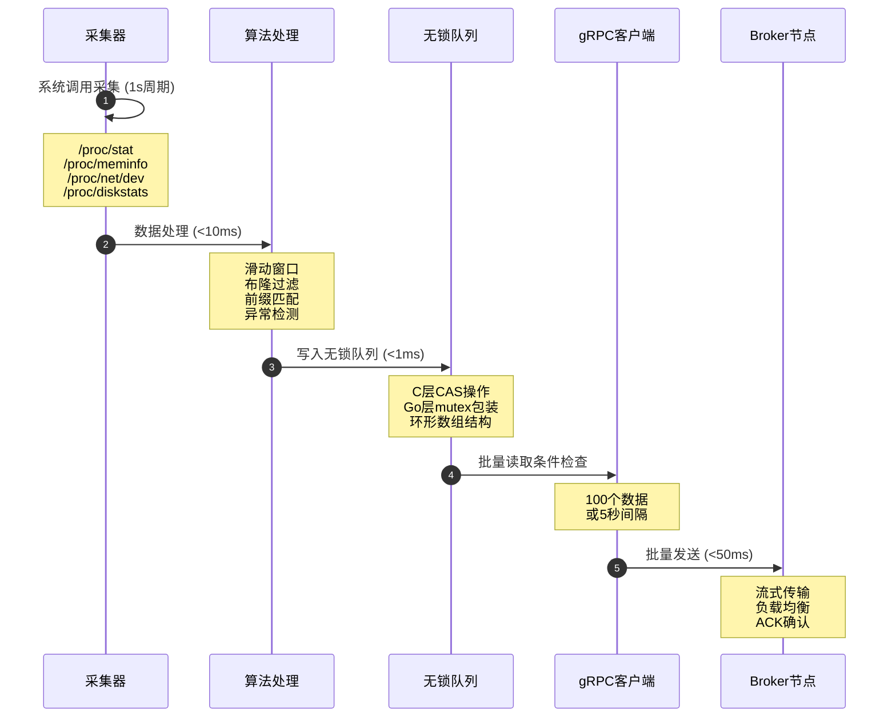

# Agent内部处理流程详解

## 📋 概述

Agent作为分布式监控系统的数据采集终端，承担着系统指标采集、数据处理、缓冲管理、批量上报等关键职责。采用Go+C混合架构，通过无锁队列、算法优化、批量处理等技术实现高性能数据采集。

### 核心职责
- **指标采集**: 采集CPU、内存、网络、磁盘等系统指标
- **算法处理**: 滑动窗口、布隆过滤器、时间轮、前缀树数据处理
- **缓冲管理**: C语言无锁队列提供高性能数据缓冲
- **批量上报**: gRPC流式传输批量上报到Broker集群

## 🏗️ 整体架构

### 分层架构设计

```
┌─────────────────────────────────────────────────────────────────┐
│                         Agent节点架构                            │
├─────────────────┬─────────────────┬─────────────────┬───────────┤
│    采集层       │    处理层       │    缓冲层       │  传输层   │
├─────────────────┼─────────────────┼─────────────────┼───────────┤
│ • 系统调用      │ • 滑动窗口      │ • 无锁队列      │ • gRPC    │
│ • 指标采集      │ • 布隆过滤      │ • CAS+mutex     │ • 流式    │
│ • 并发采集      │ • 异常检测      │ • 批量缓冲      │ • 批量    │
│ • 数据格式化    │ • 前缀匹配      │ • 背压控制      │ • 负载均衡│
└─────────────────┴─────────────────┴─────────────────┴───────────┘
```

### 组件交互关系

```
采集器群 → 算法处理 → 无锁队列 → 批量发送 → Broker集群
    │         │         │         │         │
    ▼         ▼         ▼         ▼         ▼
 并发采集    算法增强    高性能缓冲   流式传输   分布式存储
```

## 🚀 启动阶段流程

### 1. **主程序初始化流程**

```
启动命令 → 解析配置 → 创建组件 → 注册采集器 → 启动服务
    │         │         │         │           │
    ▼         ▼         ▼         ▼           ▼
  ./agent   agent.yaml  组件创建   采集器注册   开始采集
```

#### **配置加载流程**
```
配置文件 → YAML解析 → 验证参数 → 设置默认值 → 配置对象
    │         │         │         │           │
    ▼         ▼         ▼         ▼           ▼
agent.yaml  结构解析   参数验证   默认设置     Config实例
```

#### **采集器注册流程**
```
采集器创建 → CPU采集器 → 内存采集器 → 网络采集器 → 磁盘采集器
    │           │           │           │           │
    ▼           ▼           ▼           ▼           ▼
管理器创建    系统调用     系统调用     系统调用     系统调用
          /proc/stat   /proc/meminfo /proc/net/dev /proc/diskstats
```

### 2. **算法管理器初始化流程**

#### **滑动窗口初始化**
```
窗口创建 → 默认窗口 → CPU窗口 → 内存窗口 → 网络窗口 → 磁盘窗口
    │         │        │        │        │        │
    ▼         ▼        ▼        ▼        ▼        ▼
窗口管理   10个数据点   专用窗口   专用窗口   专用窗口   专用窗口
         10秒TTL    自适应     自适应     自适应     自适应
```

#### **布隆过滤器初始化**
```
过滤器创建 → 位数组 → 哈希函数 → 误判率 → 去重功能
    │         │        │        │        │
    ▼         ▼        ▼        ▼        ▼
过滤器实例   100k位    3个函数   0.001    告警去重
```

#### **时间轮初始化**
```
时间轮创建 → 槽位设置 → 精度设置 → 调度器 → 定时任务
    │         │        │        │        │
    ▼         ▼        ▼        ▼        ▼
时间轮实例   60槽位    100ms    调度器    任务管理
```

#### **前缀树初始化**
```
前缀树创建 → 路由规则 → 匹配模式 → 分类逻辑 → 默认规则
    │         │        │        │        │
    ▼         ▼        ▼        ▼        ▼
前缀树实例   host-*    通配符    指标分类   default
          server-*   模糊匹配   路由分发   处理
```

## 📊 采集阶段流程

### 1. **采集循环启动流程**

```
网络连接 → 采集器启动 → 协程创建 → 状态监控 → 开始采集
    │         │          │         │         │
    ▼         ▼          ▼         ▼         ▼
gRPC连接   采集器组     协程池    健康检查   采集循环
```

### 2. **采集定时器流程**

```
定时触发 → 并发采集 → 数据收集 → 数据合并 → 批次处理
    │         │         │         │         │
    ▼         ▼         ▼         ▼         ▼
  1秒间隔    4个采集器   指标数据   批次合并   进入处理
```

### 3. **指标采集流程**

#### **CPU采集流程**
```
系统调用 → 文件读取 → 数据解析 → 计算使用率 → 格式化输出
    │         │         │         │           │
    ▼         ▼         ▼         ▼           ▼
/proc/stat  读取文件   解析时间   CPU百分比    指标数据
```

#### **内存采集流程**
```
系统调用 → 文件读取 → 数据解析 → 计算使用率 → 格式化输出
    │         │         │         │           │
    ▼         ▼         ▼         ▼           ▼
/proc/meminfo 读取文件  解析内存   内存百分比   指标数据
```

#### **网络采集流程**
```
系统调用 → 文件读取 → 接口解析 → 计算流量 → 格式化输出
    │         │         │         │         │
    ▼         ▼         ▼         ▼         ▼
/proc/net/dev 读取文件  网络接口   流量计算   指标数据
```

#### **磁盘采集流程**
```
系统调用 → 文件读取 → 设备解析 → 计算IOPS → 格式化输出
    │         │         │         │         │
    ▼         ▼         ▼         ▼         ▼
/proc/diskstats 读取文件 磁盘设备  IOPS计算  指标数据
```

## 🔄 处理阶段流程

### 1. **算法处理流程**

```
数据读取 → 滑动窗口 → 布隆过滤 → 前缀匹配 → 异常检测
    │         │         │         │         │
    ▼         ▼         ▼         ▼         ▼
无锁队列   窗口计算    去重处理    路由分类   异常识别
```

### 2. **滑动窗口处理流程**

```
指标数据 → 窗口选择 → 数据添加 → 统计计算 → 异常检测 → 自适应调整
    │         │         │         │         │         │
    ▼         ▼         ▼         ▼         ▼         ▼
CPU/内存   对应窗口    窗口更新   平均值     2σ阈值    窗口调整
/网络/磁盘  (专用)     (新数据)   标准差     异常检测   (1.5/0.8)
```

### 3. **布隆过滤器去重流程**

```
数据输入 → 键值生成 → 重复检查 → 数据过滤 → 更新过滤器
    │         │         │         │         │
    ▼         ▼         ▼         ▼         ▼
指标数据   唯一键值   布隆查询   过滤重复   添加新键
```

### 4. **前缀树路由流程**

```
指标名称 → 规则匹配 → 分类确定 → 路由分发 → 默认处理
    │         │         │         │         │
    ▼         ▼         ▼         ▼         ▼
metric名   前缀匹配   确定类型   分发路径   default
```

## 📦 缓冲阶段流程

### 1. **C语言无锁队列结构**

```
队列创建 → 内存分配 → 索引初始化 → C层CAS → Go层包装
    │         │         │           │         │
    ▼         ▼         ▼           ▼         ▼
队列实例   固定大小   头尾指针     原子操作   并发安全
        1024容量    (head/tail)   (CAS)    (Go mutex)
```

### 2. **数据写入流程**

```
数据准备 → 空间检查 → CAS写入 → 索引更新 → 信号通知
    │         │         │         │         │
    ▼         ▼         ▼         ▼         ▼
Go数据    容量检查    原子写入   尾指针     通知读取
转C结构   (队列满?)   (数据)    更新       线程
```

### 3. **数据读取流程**

```
读取请求 → 数据检查 → 批量读取 → 索引更新 → 数据转换
    │         │         │         │         │
    ▼         ▼         ▼         ▼         ▼
读取线程   队列状态   批量获取   头指针     C转Go
        (有数据?)   (最多100)   更新       结构
```

## 📡 上报阶段流程

### 1. **gRPC客户端连接流程**

```
连接建立 → 连接池 → 负载均衡 → 连接监控 → 自动重连
    │         │       │         │         │
    ▼         ▼       ▼         ▼         ▼
Broker连接  连接复用  节点选择   健康检查   断线重连
```

### 2. **数据发送流程**

```
节点选择 → 流式连接 → 数据序列化 → 批量发送 → 响应处理
    │         │         │           │         │
    ▼         ▼         ▼           ▼         ▼
Broker节点  gRPC流    Protobuf    批量传输   ACK确认
```

### 3. **批量上报策略**

```
数据累积 → 阈值检查 → 触发条件 → 批量发送 → 缓冲清理
    │         │         │         │         │
    ▼         ▼         ▼         ▼         ▼
100个数据   数量/时间   100个或     gRPC发送   清空缓冲
        (100/5s)    5秒触发    批量传输
```

## 🔄 完整数据流时序

### 1. **正常采集周期（1秒）**



### 2. **异常处理流程**

#### **网络异常处理**
```
连接断开 → 检测异常 → 重试策略 → 本地缓存 → 恢复发送
    │         │         │         │         │
    ▼         ▼         ▼         ▼         ▼
网络故障   连接检测   指数退避   数据缓存   批量发送
                  (1s,2s,4s)  (本地)    (恢复后)
```

#### **系统过载处理**
```
过载检测 → 降低频率 → 丢弃数据 → 系统恢复 → 恢复采集
    │         │         │         │         │
    ▼         ▼         ▼         ▼         ▼
队列满    采集降频   低优先级   资源释放   正常频率
        (2s间隔)   数据丢弃   (恢复)    (1s间隔)
```

#### **资源不足处理**
```
资源监控 → 降级算法 → 简化处理 → 资源释放 → 恢复处理
    │         │         │         │         │
    ▼         ▼         ▼         ▼         ▼
CPU/内存   禁用算法   基础采集   资源回收   完整功能
监控      组件      (简化)    (GC)      (恢复)
```

## 📊 性能监控指标

### 1. **采集性能流程**

```
采集开始 → 延迟测量 → 频率统计 → 准确性检查 → 稳定性评估
    │         │         │         │           │
    ▼         ▼         ▼         ▼           ▼
系统调用   耗时统计   QPS计算   数据验证     抖动检测
```

### 2. **处理性能流程**

```
算法处理 → 时间统计 → 内存监控 → CPU监控 → 吞吐统计
    │         │         │         │         │
    ▼         ▼         ▼         ▼         ▼
算法执行   耗时测量   内存占用   CPU使用   处理速率
```

### 3. **网络性能流程**

```
数据发送 → 延迟测量 → 吞吐统计 → 连接监控 → 错误统计
    │         │         │         │         │
    ▼         ▼         ▼         ▼         ▼
gRPC发送   RTT测量   带宽使用   连接状态   错误率
```

## 🎯 优化策略

### 1. **性能优化流程**

```
批量处理 → 异步操作 → 内存池 → 连接复用 → 性能提升
    │         │         │       │         │
    ▼         ▼         ▼       ▼         ▼
减少网络   提高并发   减少GC   减少握手   整体优化
往返次数   处理能力   开销     开销       效果
```

### 2. **稳定性优化流程**

```
容错机制 → 降级策略 → 监控告警 → 自动恢复 → 稳定运行
    │         │         │         │         │
    ▼         ▼         ▼         ▼         ▼
异常处理   智能降级   实时监控   自动修复   稳定服务
```

### 3. **可扩展性优化流程**

```
模块化 → 配置驱动 → 插件机制 → 水平扩展 → 弹性伸缩
    │       │         │         │         │
    ▼       ▼         ▼         ▼         ▼
组件独立   参数调整   功能扩展   多实例     动态调整
```

## 📝 总结

### **Agent核心特性**

```
高性能采集 → 算法增强 → 无锁缓冲 → 批量传输 → 可靠上报
    │           │         │         │         │
    ▼           ▼         ▼         ▼         ▼
系统调用优化   智能处理   CAS+mutex   流式传输   分布式存储
```

### **技术架构优势**

#### **高性能采集**
```
并发采集 → 算法优化 → 无锁队列 → 批量处理 → 高吞吐量
    │         │         │         │         │
    ▼         ▼         ▼         ▼         ▼
4个采集器   滑动窗口   CAS+mutex   批量发送   性能优化
```

#### **智能处理**
```
原始数据 → 滑动窗口 → 布隆过滤 → 前缀匹配 → 异常检测
    │         │         │         │         │
    ▼         ▼         ▼         ▼         ▼
系统指标   统计分析   去重处理   路由分类   异常识别
```

#### **可靠传输**
```
本地缓冲 → 批量聚合 → gRPC流 → 负载均衡 → 可靠送达
    │         │         │         │         │
    ▼         ▼         ▼         ▼         ▼
无锁队列   批量优化   流式传输   多节点     确认机制
```

### **应用场景**

#### **高频采集**
```
系统监控 → 1秒采集 → 实时处理 → 低延迟 → 及时上报
    │         │         │         │       │
    ▼         ▼         ▼         ▼       ▼
指标采集   高频率     算法处理   <200ms   实时传输
```

#### **大规模部署**
```
多主机 → 并发采集 → 分布式处理 → 集中存储 → 统一管理
    │       │         │           │         │
    ▼       ▼         ▼           ▼         ▼
1000+主机  并发能力   算法优化     Broker    统一监控
```

#### **稳定运行**
```
长期运行 → 资源控制 → 异常处理 → 自动恢复 → 持续服务
    │         │         │         │         │
    ▼         ▼         ▼         ▼         ▼
7x24小时   内存管理   容错机制   自动修复   稳定可靠
```

Agent通过**高性能采集**、**算法增强处理**、**队列缓冲（C层CAS+Go层mutex）**、**批量可靠传输**，为分布式监控系统提供了高质量的数据基础，确保监控数据的**实时性**、**准确性**和**可靠性**。