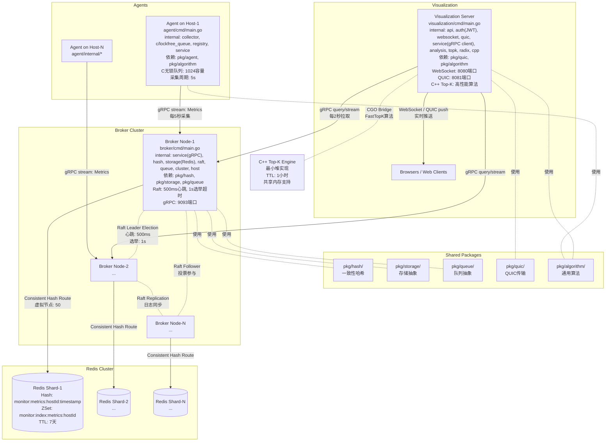
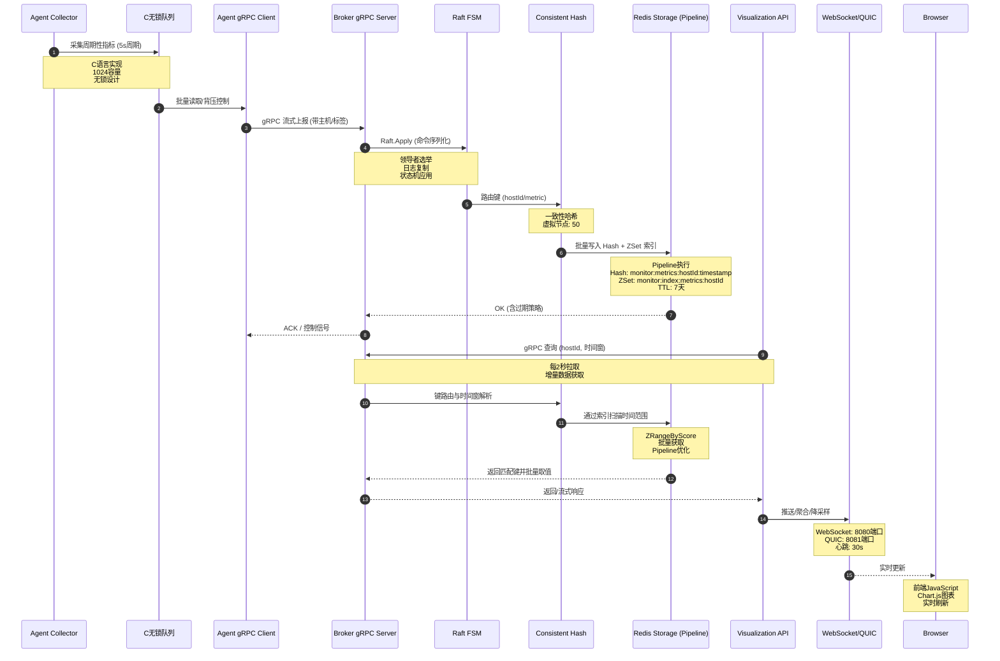
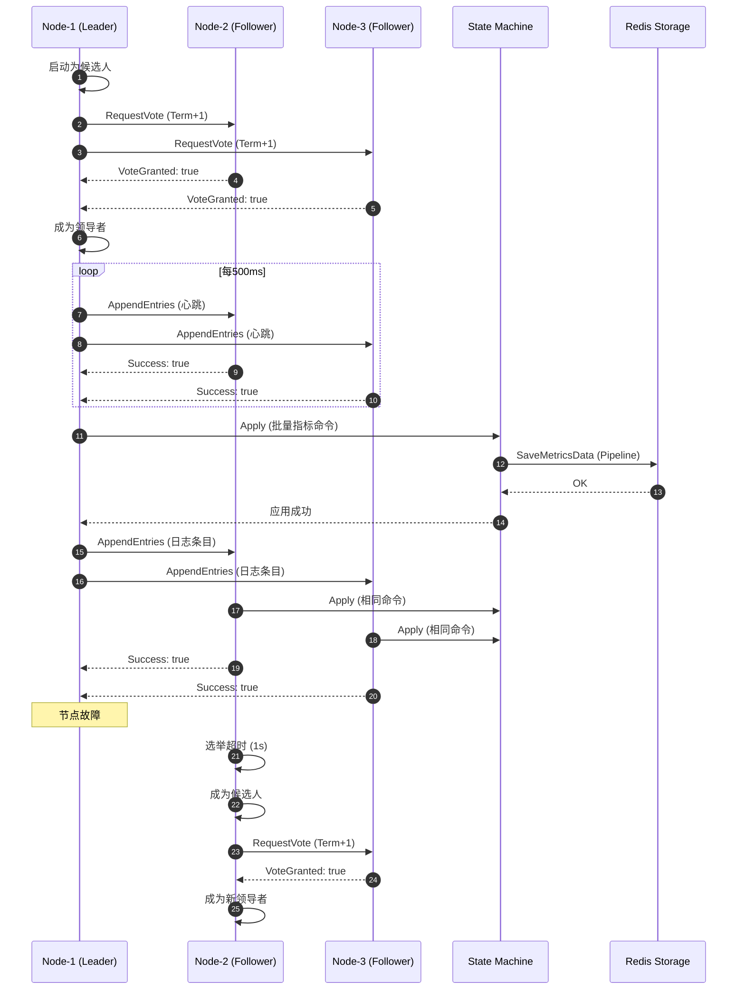
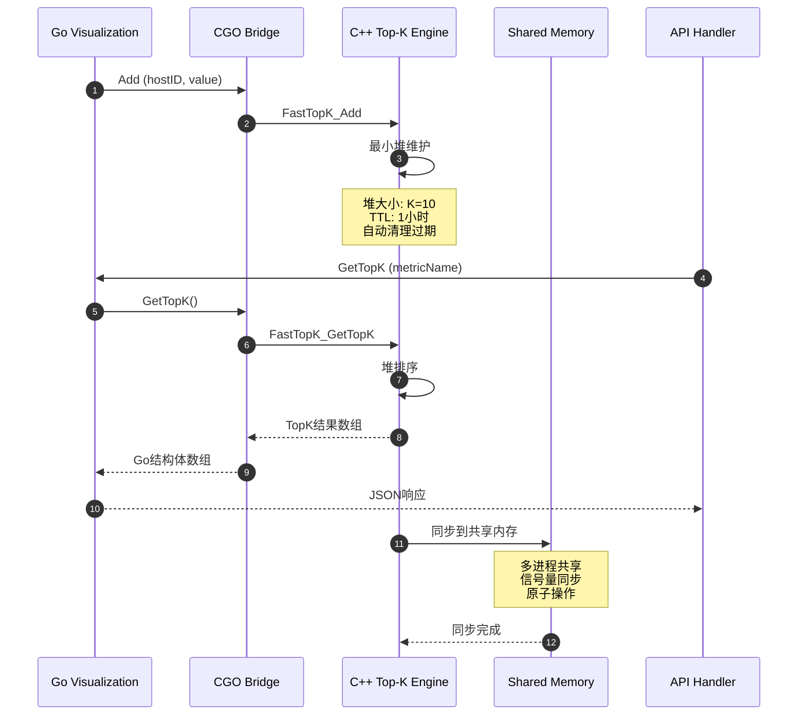
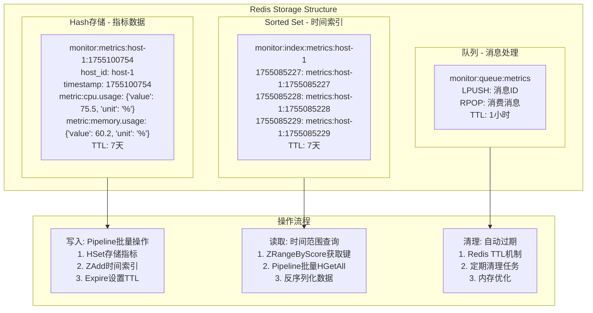
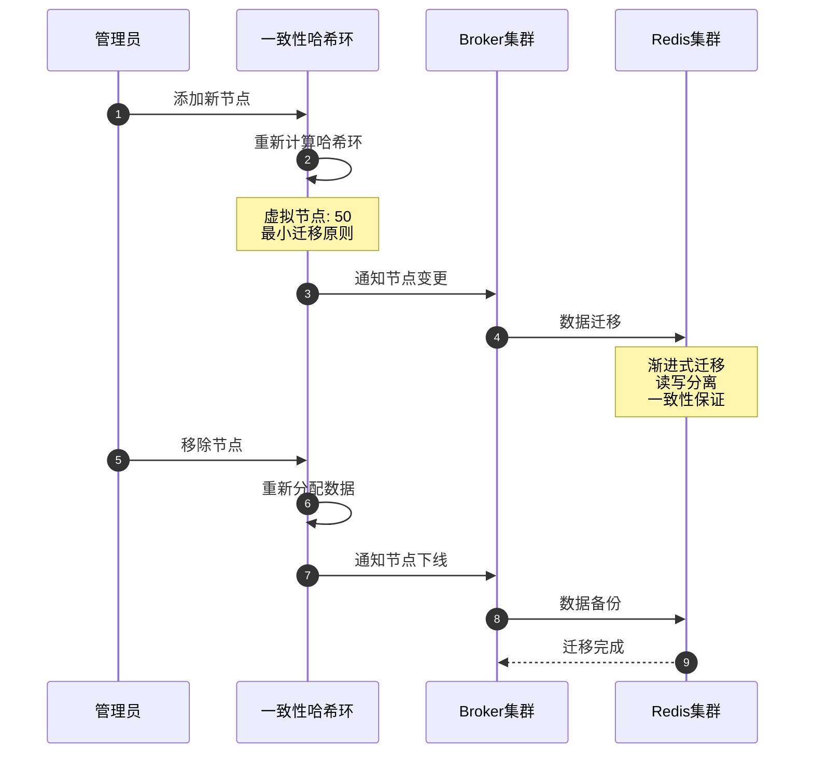

## 系统架构与数据流详解

本文结合实际项目结构，详细说明 Agent、Broker、Visualization 三大组件的模块划分、目录位置、数据流向与 Redis 的使用位置；并提供一幅可视化架构图。

### 1. 组件与目录定位

#### 1.0 项目整体结构
```
/home/han-fei/monitor/
├── agent/           # Agent服务
├── broker/          # Broker服务
├── visualization/   # Visualization服务
├── pkg/            # 共享包目录（跨组件复用）
├── internal/       # 顶层内部工具
├── proto/          # gRPC协议定义
├── configs/        # 配置文件
├── static/         # 顶层静态文件
├── data/           # 数据目录
└── bin/            # 编译输出
```

#### 1.0.1 共享包模块（pkg/）
- `pkg/agent/`：Agent相关的共享组件
- `pkg/algorithm/`：通用算法库（跨组件使用）
- `pkg/broker/`：Broker相关的共享组件（消息队列等）
- `pkg/hash/`：一致性哈希算法实现（核心分片逻辑）
- `pkg/queue/`：队列抽象层（支持多种后端）
- `pkg/quic/`：QUIC协议实现（高性能传输）
- `pkg/storage/`：存储抽象层（支持Redis、其他TSDB）

#### 1.0.2 顶层工具模块
- `internal/utils/`：项目级通用工具函数
- `static/`：前端静态资源（可能是构建输出）
- `data/`：运行时数据存储目录

#### 1.1 Agent（数据采集代理）
- 入口：`agent/cmd/main.go`
- 模块目录：`agent/internal/`
  - `collector/`：系统指标采集（CPU、内存、网络、磁盘等），采集周期与指标项受 `configs/agent.yaml` 控制
  - `c/`：C 语言高性能组件（无锁队列等），用于采集端高吞吐缓冲与批处理
  - `algorithm/`：轻量统计/滑动窗口等小型算法（采集端近源计算）
  - `registry/`：主机注册与心跳管理，与 Broker 进行发现与健康上报
  - `service/`：gRPC 客户端，负责与 Broker 建立流式连接进行指标上报
  - `config/`、`models/`：配置加载与数据模型

职责要点：
- 低开销、周期性采集；本地环形缓冲；批量化上报；在高负载/网络抖动场景具备背压与丢弃策略（优先丢低优先级指标）。
- **依赖共享包**：使用 `pkg/agent/` 中的通用组件，`pkg/algorithm/` 中的统计算法。

#### 1.2 Broker（分布式消息中转与存储）
- 入口：`broker/cmd/main.go`
- 模块目录：`broker/internal/`
  - `service/`：gRPC 服务器，接收 Agent 指标与提供给 Visualization 的查询接口
  - `hash/`：一致性哈希（含虚拟节点）进行分片路由，减小扩缩容时的数据迁移
  - `storage/`：Redis 存储适配层（热数据、窗口聚合结果、短期查询缓存）
  - `raft/`：Raft 共识（Leader 选举、日志复制、快照）保证关键元数据与控制面的强一致
  - `cluster/`、`host/`：集群与主机管理（健康、扩缩容、元数据维护）
  - `queue/`：内部队列/缓冲，承接写路径的峰值与抖动
  - `config/`、`models/`：配置与数据模型

职责要点：
- 写路径：接收 → 分片 → 批处理 → Redis 写入；读路径：按键路由 → 从 Redis 或内存缓存读取 → 返回/流式输出。
- **依赖共享包**：核心分片逻辑在 `pkg/hash/`，存储抽象在 `pkg/storage/`，队列实现在 `pkg/queue/`。

#### 1.3 Visualization（可视化与实时推送）
- 入口：`visualization/cmd/main.go`
- 模块目录：`visualization/internal/`
  - `api/`：HTTP API（状态、指标查询等），结合 `service/` 访问 Broker
  - `auth/`：JWT 认证授权，保护 API、WebSocket 等需要鉴权的端点
  - `websocket/`：实时推送服务，面向浏览器推送增量指标
  - `quic/`：可选的 QUIC 传输通道，弱网/移动网络下提升实时链路质量
  - `service/`：gRPC 客户端，向 Broker 查询历史/聚合数据或订阅流式数据
  - `analysis/`、`topk/`：可视化侧数据分析/排行（含 C++ Top-K 模块）
  - `radix/`：基数树，对路由/规则/订阅名称前缀做高效匹配
  - `cpp/`：C++ 高性能算法桥接
  - `config/`、`models/`：配置与数据模型

职责要点：
- 汇聚查询与实时推送中心；通过 gRPC 从 Broker 拉取数据，再通过 WebSocket/QUIC 下发给前端客户端。
- **依赖共享包**：高性能传输使用 `pkg/quic/`，通用算法使用 `pkg/algorithm/`。

### 2. 契约与配置
- RPC 契约：`proto/monitor.proto`
- 配置文件：`configs/agent.yaml`、`configs/broker.yaml`、`configs/visualization.yaml`

### 3. 数据流（端到端）
1) 采集与预处理（Agent）
- `collector/` 周期性采集指标，写入 `c/` 中的无锁队列；
- `algorithm/` 可进行滑动窗口/轻量聚合；
- `service/` 将批量指标通过 gRPC 流式上报至 Broker。

2) 接收、分片与存储（Broker）
- `service/` 接收指标，将记录按主机/指标键送入 `hash/` 一致性哈希；
- 按落点选择 Redis 分片，经 `storage/` 写入；
- `raft/` 负责控制面强一致（领导者、配置等），`queue/` 作为写路径缓冲。

3) 查询与实时分发（Visualization）
- `service/` 通过 gRPC 到 Broker 查询历史/聚合或订阅流；
- `analysis/`、`topk/` 对数据做 Top-K/异常分析；
- `websocket/`/`quic/` 将结果推送到浏览器；
- `auth/` 通过 JWT 保护 API 与实时路由。

### 4. Redis 的使用位置与策略
- 使用位置：`broker/internal/storage/`（Broker 独占使用，Visualization 不直接访问 Redis）。
- 使用场景：
  - 热数据（短期时序指标）存储与 TTL 管理；
  - 窗口级聚合结果与短期查询缓存（减少重复计算）；
  - 主机状态/心跳等轻量元数据的缓存化（非强一致数据）。
- 策略要点：
  - Cluster 分片 + 一致性哈希路由，扩缩容迁移量可控；
  - 读写分离（读从库）提升查询并发；
  - 历史冷数据按需下沉到对象存储/TSDB（由运维策略决定）。

#### 4.1 键空间与 TTL 策略（与实现对齐）
- 键前缀：`monitor:`（可在配置中覆盖，参考 `broker/internal/storage/redis_storage.go`）。
- 指标主键（哈希）：`monitor:metrics:{hostId}:{timestamp}`
  - 字段：`host_id`、`timestamp`、`metric:{name}`（JSON）、`tag:{name}`
  - TTL：7 天（保存与索引同时设置过期）
- 指标时间索引（有序集合）：`monitor:index:metrics:{hostId}`
  - 成员：完整主键 `monitor:metrics:{hostId}:{timestamp}`
  - 分数：`timestamp`
  - TTL：7 天
- 消息/队列（示例）：`monitor:{prefix}:message:{messageId}`（`broker/internal/queue/`）
  - 值：消息序列化数据
  - TTL：按队列配置 `q.ttl`
- 通用 KV：通过 `Set/SetWithTTL/Expire` 受 `DefaultTTL` 控制（配置文件 `configs/broker.yaml`）。

说明：以上键模式直接来源于存储实现与 FSM 写路径，便于查询、回放与过期管理的一致性。

### 5. 详细架构图（组件与数据流）



### 6. 写/读路径时序图



### 7. Raft共识机制详细流程



### 8. C++ Top-K算法集成流程



### 9. Redis存储结构详细设计



### 10. 关键路径梳理

#### **写入路径（Agent → Broker → Redis）**
1. **Agent采集**: 每5秒采集系统指标，使用C语言Ring Buffer缓冲
2. **批量处理**: C Ring Buffer提供背压控制，批量读取数据
3. **gRPC传输**: 流式上报到Broker，支持重试和错误处理
4. **Raft共识**: Broker通过Raft确保数据一致性，领导者选举和日志复制
5. **哈希路由**: 一致性哈希算法路由到对应Redis分片
6. **Redis存储**: Pipeline批量写入Hash和ZSet，设置7天TTL

#### **读取路径（Visualization → Broker → Redis）**
1. **查询请求**: Visualization每2秒从Broker拉取增量数据
2. **时间范围**: 基于时间戳范围查询，避免全量扫描
3. **索引查询**: 通过ZSet索引快速定位时间范围内的数据
4. **批量获取**: Pipeline批量读取Hash数据，提升性能
5. **数据转换**: 将Redis数据转换为protobuf格式返回

#### **实时推送（Visualization → Client）**
1. **数据聚合**: 服务端聚合和分析实时数据
2. **双通道推送**: WebSocket (8080端口) 和 QUIC (8081端口)
3. **C++ Top-K**: 高性能Top-K算法计算，支持TTL和共享内存
4. **前端更新**: JavaScript实时更新Chart.js图表
5. **故障处理**: 慢消费者背压、降采样或丢帧策略

### 11. 扩缩容与一致性哈希迁移



### 12. 性能优化策略

#### **Agent层优化**
- **C语言无锁队列**: 高性能CAS操作，1024容量固定
- **批量采集**: 5秒周期批量采集，减少系统调用
- **背压控制**: 队列满时自动背压，防止内存溢出

#### **Broker层优化**
- **Raft共识**: 500ms心跳，1s选举超时，快速故障转移
- **一致性哈希**: 50个虚拟节点，负载均衡
- **Pipeline操作**: Redis批量操作，减少网络往返

#### **Visualization层优化**
- **C++ Top-K**: 最小堆算法，O(log K)时间复杂度
- **增量拉取**: 每2秒拉取增量数据，避免全量扫描
- **双通道推送**: WebSocket + QUIC，高可用性

#### **存储层优化**
- **TTL策略**: 7天自动过期，控制存储成本
- **索引优化**: ZSet时间索引，O(log N)范围查询
- **Pipeline批量**: 减少Redis网络往返次数


